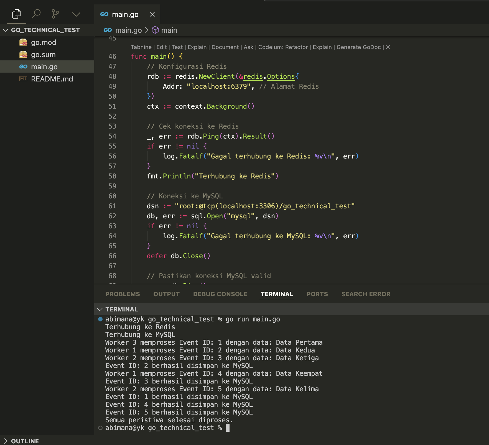

# Event Processing

## Description

This project is a simple event processing system that reads events from a file, processes them, and stores the results in a database.

## How to Run

1. Clone the repository
2. Install dependencies `go mod tidy`
3. Run `go run main.go`

## How to Run Redis

1. `redis-server` to start the Redis server
2. `redis-cli` to start the Redis client

```
redis-cli GET event:1
redis-cli GET event:2
```


